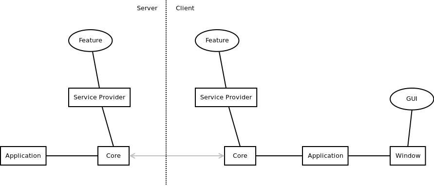

# Architecture and overview

This article gives a brief overview of all of the different components that makes up OS.js.

## Codebase

All of the source is written in [ES6+](http://es6-features.org/). Dependencies are managed with [npm](https://docs.npmjs.com/).

Client-side scripts are written as [ECMAScript Modules (ESM)](https://developer.mozilla.org/en-US/docs/Web/JavaScript/Guide/Modules),
transpiled with [Babel](https://babeljs.io/) and CSS is written in [Sass](https://sass-lang.com/). Finally bundled with [Webpack](#webpack).

The server-side scripts are written as [CommonJS Modules](https://nodejs.org/docs/latest/api/modules.html) and runs purely on [Nodejs](https://nodejs.org/en/).

Testing is done with [ESLint](https://eslint.org/), [Stylelint](https://stylelint.io/) and [Jest](https://jestjs.io/).

## Overview

OS.js is a modular Web Desktop framework that consists of two parts: a client and a server.

The client can run independently from the server, but the server provides a lot of features like persistent settings, authentication and backend filesystems.

Server runs on [Express](https://expressjs.com/) and [Nodejs](https://nodejs.org/) (version 12 or later)

Features are implemented via [service providers](../../guide/provider/README.md) so you can extend, replace or remove most features on your own.



> *Simplified diagram of components and their relation.*

These are the standard used core libraries:

* https://github.com/os-js/osjs-common - Base (used in both client & server)
* https://github.com/os-js/osjs-client - Client Core & Services
* https://github.com/os-js/osjs-server - Server Core & Services
* https://github.com/os-js/osjs-cli - CLI utilities
* https://github.com/os-js/osjs-gui - GUI components
* https://github.com/os-js/osjs-dialogs - GUI Dialogs
* https://github.com/os-js/osjs-panels - GUI Panels
* https://github.com/os-js/osjs-event-emitter - EventEmitter implementation
* https://github.com/os-js/osjs-dev-meta - Development dependencies
* https://github.com/os-js/eslint-config - ESLint configuration
* https://github.com/os-js/stylelint-config - Stylelint configuration

All source-code follows the [semantic versioning spesification](https://semver.org/).

## Installation (Distribution)

The [OS.js repository](https://github.com/os-js/OS.js) contains a boilerplate you can use to build and bundle your own installations and distributions.

It comes with the following structure, that you can modify as you see fit:

```text
docker-compose.yml       Docker Compose configuration
entrypoint.sh            Docker execution entrypoint
webpack.config.js        Webpack building configuration
package.json             Dependency definitions
node_modules/            Dependencies (npm package)
dist/                    Build output
vfs/                     Filesystem storage
src/                     Sources
    packages/            Custom packages directory
    client/
        index.js         Client bootstrap script
        index.ejs        Base HTML template
        index.scss       Base CSS template
        config.js        Configuration(s)
        favicon.png      Favicon
    server/
        index.js         Server bootstrap script
        config.js        Configuration(s)
    cli/
        index.js         CLI bootstrap script
```

## Modules

Modules come in several forms and provides ways to extend base functionality.

* [Service provider](../../guide/provider/README.md)
* [CLI task](../../guide/cli/README.md#custom-task)
* [Authentication adapter](../../guide/auth/README.md)
* [Settings adapter](../../guide/settings/README.md)
* [Filesystem adapter](../../guide/filesystem/README.md)

See the [official extensions](../official/README.md) for a list of available modules.

## Packages

Packages also come in several types.

* [Application](../../tutorial/application/README.md)
* [Iframe Application](../../tutorial/iframe/README.md) (same as above, but different template)
* [Theme](../../tutorial/theme/README.md#styles)
* [Icons](../../tutorial/theme/README.md#icons)

The standard structure of a package looks like the following:

```text
webpack.config.js        Webpack building configuration
metadata.json            Package information
package.json             Dependency definitions
index.js                 Client source
index.scss               Client styles
server.js                Server source (applications only)
node_modules/            Dependencies (npm package)
dist/                    Build output
```

See the [official extensions](../official/README.md) for a list of available packages.

# Webpack

[Webpack](https://webpack.js.org/) is used to build and bundle the installation/distribution, modules and packages.

These are some of the plugins and loaders used throughout codebases (mostly via the [dev meta package](https://github.com/os-js/osjs-dev-meta)):

* [html-webpack-plugin](https://github.com/jantimon/html-webpack-plugin)
* [copy-webpack-plugin](https://www.npmjs.com/package/copy-webpack-plugin)
* [mini-css-extract-plugin](https://github.com/webpack-contrib/mini-css-extract-plugin)
* [optimize-css-assets-webpack-plugin](https://github.com/NMFR/optimize-css-assets-webpack-plugin)
* [babel-loader](https://github.com/babel/babel-loader)
* [file-loader](https://github.com/webpack-contrib/file-loader)
* [sass-loader](https://github.com/webpack-contrib/sass-loader)
* [css-loader](https://github.com/webpack-contrib/css-loader)
