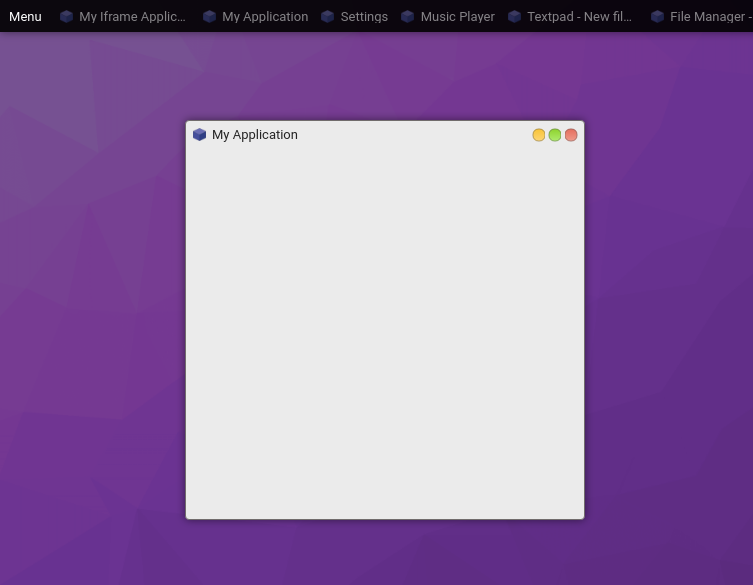

# Window Tutorial

This tutorial shows you how to create and interact with Windows.

Windows are floating containers that you can use to render any content.



## Usage

To create a new `Window` instance:

```javascript
const options = {title: 'My Window'};

// Attach to the application
const win = proc.createWindow(options)

// Outside your application
const win = core.make('osjs/window', options)
```

## Render

Use the provided render method to put content into your Window via a DOM element.

> [info] This DOM element is the root of the contents allowing you to use anything from
> plain HTML as strings to advanced frameworks.

```javascript
win.render($content => $content.appendChild(
  document.createTextNode('Hello World!')
));
```

See [GUI tutorial](../gui/README.md) on how to use the design user interfaces with
the official reactive GUI component library.

## Options

* `id` A unique identifier
* `title` The title
* `parent` Parent window instance
* `position: {top?: number, left?: nubmer} | string` Position object or a string (ex: `center`, `topleft`, `bottomright`, etc)
* `dimension: {width?: number, height?: number}` Dimension object
* `attributes` A set of attributes
* `state: {maximized?: boolean, minimized?: boolean}` Default state

Example:

```javascript
proc.createWindow({
  title: 'My Window'
})
```

## Attributes

* `gravity: string` - Where to place the window (ex: `center`, `topleft`, `bottomright`, etc)
* `modal: boolean` - If a parent is provided it will be disabled until this window  closes
* `ontop: boolean` - Place on-top of all other windows
* `resizable: boolean` - Set if window can be resized
* `focusable: boolean` - Set if window can be focused
* `maximizable: boolean` - Set if window can be minimized
* `minimizable: boolean` - Set if window can be maximized
* `sessionable: boolean` - Set if window can be saved in session
* `droppable: boolean` - Set if window can receive drop events
* `closeable: boolean` - Set if window can be closed
* `header: boolean` - Header visibility
* `controls: boolean` - Header controls visibility (min/max/close buttons)
* `position: {top: number, left: number}` - Default position
* `minDimension: {width: number, height: number}` - Minimum dimension
* `maxDimension: {width: number, height: number}` - Maximum dimension
* `visibility: string` - Set to `restricted` to hide from the panels, etc.
* `clamp: boolean` - Clamps window position to the viewport if it overflows (default)

Example:

```javascript
proc.createWindow({
  attributes: {
    ontop: true
  }
})
```

> [info] You can define initial window position and dimension by percentage using a float between `0.0 - 1.0`. Example: `{position: {left: 0.5, top: 0.5}}`.

## Events

* `moved => (position, win)` - After movement completes
* `resized => (dimension, win)` - After resize completes
* `destroy => (win)` - Destroyed
* `init => (win)` - On init
* `render => (win)` - On render
* `close => (win)` - On close
* `focus => (win)` - On focus
* `blur => (win)` - On blur
* `minimize => (win)` - On minimize
* `maximize => (win)` - On maximize
* `raise => (win)` - On "un-minimize"
* `restore => (win)` - On "un-maximize"
* `dragenter => (ev, win)` - On "drag enter"
* `dragover => (ev, win)` - On "drag over"
* `dragleave => (ev, win)` - On "drag leave"
* `drop => (ev, data, files, win)` - On "drop"
* `keypress => (ev, win)` - On "keypress"
* `keydown => (ev, win)` - On "keydown"
* `keyup => (ev, win)` - On "keyup"

You can listen on events with:

```javascript
win.on('event-name', (...args) => console.log(...args));
```

## Methods

Common methods:

```javascript
win.close(); // Close
win.destroy(); // Destroy ("force close")
win.blur(); // Un-focus
win.focus(); // Focus
win.minimize(); // Minimize
win.maximize(); // Maximize
win.raise(); // Un-minimize
win.restore(); // Un-maximize
win.gravitate(string); // Gravitate toward direction
win.resizeFit(node); // Resize to fit given DOM container
win.setIcon(string); // Sets icon
win.setTitle(string); // Sets title
win.setPosition({top?, left?}); // Sets position
win.setDimension({width?, height?}); // Sets dimension
win.setZindex(number); // Sets z-index
win.setNextZindex(); // Sets next z-index (move to top)
```

## Media Queries

You can assign local media queries to a window using attributes. By default OS.js provides:

* `small:<=640px`
* `medium:<=1024px`
* `large:>=1024px`

```javascript
const options = {
  title: 'My Window',
  attributes: {
    mediaQueries: {
      custom: 'screen and (min-width: 1280px)'
    }
  }
};
```

The `mediaQueries` key will be assigned to a `data-media=""` attribute on your Window root DOM element so you can create responsive interfaces via CSS. You can also get the media state via `win.state.media`.
