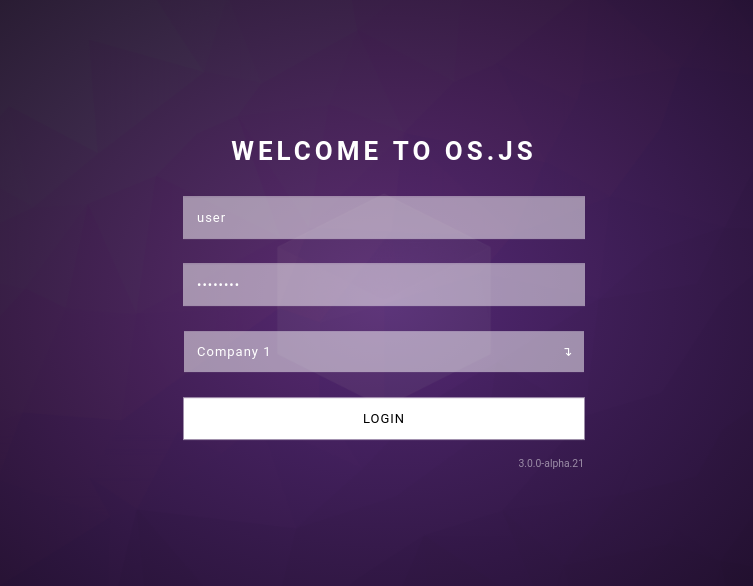

# Customizing Login Guide

You can customize the login screen both visually and functionally.

You can also [replace it entirely](#replace) by providing your own adapter.



## Basics

In your client configuration (`src/client/config.js`) you can override certain aspects of the login:

```json
{
  auth: {
    ui: {
      title: 'Welcome to Company',
      stamp: 'custom-build version 1234'
    }
  }
}
```

## Adding fields

You can set your own fields:

```json
{
  auth: {
    ui: {
      fields: [{
        tagName: 'input',
        attributes: {
          name: 'username',
          type: 'text',
          placeholder: 'Username'
        }
      }, {
        tagName: 'input',
        attributes: {
          name: 'password',
          type: 'password',
          placeholder: 'Password'
        }
      }, {
        tagName: 'select',
        attributes: {
          name: 'provider'
        },
        choices: [{
          value: 'company-1',
          label: 'Company 1'
       }, {
          value: 'company-2',
          label: 'Company 2'
       }]
      }, {
        tagName: 'input',
        attributes: {
          type: 'submit',
          value: 'Login'
        }
      }]
    }
  }
}
```

## Customizing styles

By default the login container uses the DOM id `#osjs-login`, which you can override in your configuration:

```json
{
  auth: {
    ui: {
      id: 'custom-osjs-login'
    }
  }
}
```

You can now add your own styles to `src/client/index.scss`.

## Logo

You can also add a logo via configuration and customize via CSS:


```javascript
import logo from '../logo.png';

{
  auth: {
    ui: {
      logo: {
        position: 'top', // top, bottom, left, right
        src: logo
      }
    }
  }
}
```

```css
.osjs-login-logo {
 /* Your style here */
}
```

## Replace

You can also replace the default UI with your own:

> Note that you can use your `src/client/index.html` file to add HTML content instead of programmatically adding via DOM.

### Adapter

Extend the default adapter in for example `src/client/custom-login.js`:

```javascript
import {Login} from '@osjs/client';

export default class MyCustomLogin extends Login {
  render() {
    // Set a custom class name
    this.$container.className = 'my-custom-login';

    // Add your HTML content
    this.$container.innerHTML = 'Put your content here';

    // Bind the events
    this.on('login:start', () => console.log('Currently trying to log in...'));
    this.on('login:stop', () => console.log('Login was aborted or stopped'));
    this.on('login:error', err => console.error('An error occured while logging in', err));

    // To submit a login form (ex when you press a button):
    /*
    this.emit('login:post', {
      username: 'foo',
      password: 'bar'
    });
    */
  }
}
```


You can add your own styles in `src/client/index.scss`:

```css
.my-custom-login {
  background: #fff;
  color: #000;
}
```


### Configure

In your client bootstrap script (`src/client/config.js`), update the authentication service provider:

```javascript
import MyCustomLogin from './custom-login.js';

osjs.register(AuthServiceProvider, {
  before: true,
  args: {
    login: (core, options) => new MyCustomLogin(core, options)
  }
});
```
