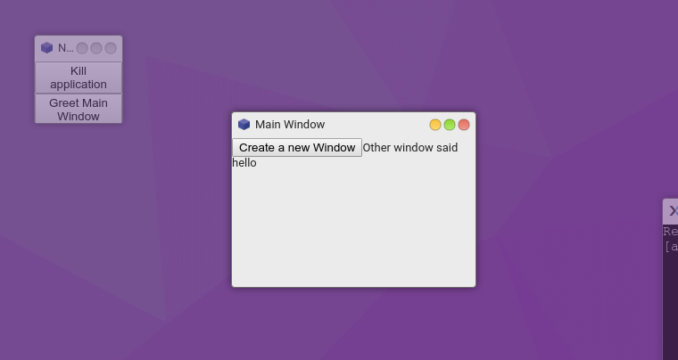

# Bus Tutorial

This tutorial will show you how to use a Bus (or EventEmitter).

> A bus (event handler/event dispatcher) provides methods to assign and emit events.


## Usage

To create your own bus use the provided service:

> [info] Your `Window` and `Application` instances extends the EventEmitter. So you can use this as your bus(es), but please consider using event names with a namespace, ex: `mynamespace:event-name` to avoid conflicting with internal events.

```javascript
// Basic usage
const bus = core.make('osjs/event-emitter');
bus.on('greet', (who) => console.log(`Hello ${who}!`));
bus.emit('greeet', 'world');

// To register a subscriber that only fires once
bus.once('greet', (who) => console.log(`Hello ${who}! But only once`));

// To unregister an event
const event = () => console.log('My event');
bus.on('foo', event);
bus.off('foo', event);

// To unregister all events
bus.off('foo');
```

## Advanced Example

In this example, we'll set up a centralized event bus that handles our application features.

This bus will also proxy events to windows and handle inter-window-communication.

It also uses a window factory to share the bus:



```javascript
// A simple helper function for creating a DOM Element in the form
// of a button. Attaches an click event via the callback.
const createButton = (label, callback) => {
  const button = document.createElement('button');
  button.appendChild(document.createTextNode(label))
  button.addEventListener('click', callback);
  return button;
};

// Renders window with a button to spawn another window.
// Listens for the 'greet' event on the window that is proxied via our bus
const mainWindow = bus => props => ($content, win) => {
  const button = createButton('Create a new Window', () => {
    bus.emit('create-window', 'other', {
      title: 'New Window'
    }, {
      foo: 'bar'
    });
  });

  win.on('custom/greet', () => {
    $content.appendChild(document.createTextNode('Other window said hello'));
  });

  $content.appendChild(button);
};

// Renders another window with a button to signal 'kill-application'
// and another for 'greet-main-window'.
const otherWindow = bus => props => ($content, win) => {
  // Custom properties passed on
  console.log(props.foo); // => "bar"

  const button1 = createButton('Kill application', () => {
    bus.emit('kill-application');
  });

  const button2 = createButton('Greet Main Window', () => {
    bus.emit('greet-main-window');
  });

  $content.appendChild(button1);
  $content.appendChild(button2);
};

// A window factory that takes a name and spawns
// the corresponding window in a map.
const windowFactory = (proc, bus) => {
  const windows = {
    main: mainWindow(bus),
    other: otherWindow(bus)
  };

  return (name, options = {}, props = {}) => {
    // Assign some static options to our main window
    if (name === 'main') {
      Object.assign(options, {
        id: 'MainWindow',
        title: 'Main Window'
      });
    }

    const renderer = windows[name](props);

    proc.createWindow(options)
      .render(renderer);
  };
};

// Your application code.
// This is where we set up a bus for sentralized event handling.
const register = (core, args, options, metadata) => {
  const proc = core.make('osjs/application', {args, options, metadata});
  const bus = core.make('osjs/event-emitter', 'SomeOptionalBusName');
  const factory = windowFactory(proc, bus);

  // Proxy the 'greet' event onto the main window if found.
  // Notice a namespace is used, as not to conflict with internal events.
  bus.on('greet-main-window', (...args) => {
    const mainWindow = proc.windows
      .find(win => win.id === 'MainWindow');

    if (mainWindow) {
      mainWindow.emit('custom/greet', ...args);
    }
  });

  // Signal to kill our application
  bus.on('kill-application', () => {
    proc.destroy();
  });

  // Signal for creating another window by name
  bus.on('create-window', (name, options, props) => {
    factory(name, options, props);
  });

  // Immediately emit a create window event to spawn main window
  bus.emit('create-window', 'main');

  // We want to remove our bus when application is destroyed
  proc.on('destroy', () => bus.destroy());

  return proc;
};

// The package manager registration call
OSjs.make('osjs/packages')
  .register('MyApplication', register);
```
