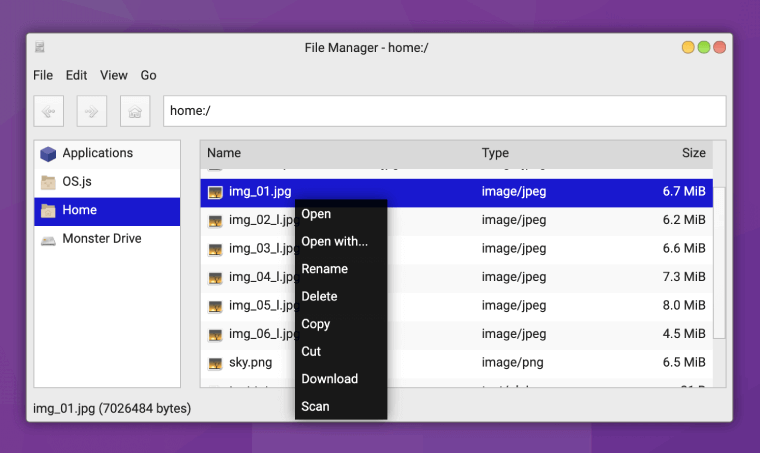

# Middleware Tutorial

This tutorial will show you how to use a middleware. A middleware is used when an application wants to provide a way for other applications to change its behavior.

## Usage

```javascript
// To add a callback to a middleware group
core.make('osjs/middleware').add('middleware-group-name', middlewareCallback);
// OR
import osjs from 'osjs';

osjs.middleware('middleware-group-name', middlewareCallback);

// To get the list of callbacks in a middleware group
const middlewareCallbacks = core.make('osjs/middleware').get('middleware-group-name');
```

## Example

In an application like a virus scanner we need to add a "Scan" option in the context menu of files in the [File Manager application](https://github.com/os-js/osjs-filemanager-application) that opens the scanner application.



The [File Manager application](https://github.com/os-js/osjs-filemanager-application) should
provide a way for other applications to add to its edit/context menu. So, it uses a middleware group for its edit/context menu.
```javascript
// File Manager when rendering edit/context menu
const items = core.make('osjs/middleware').get('osjs/filemanager:menu:edit');

const middlewarePromises = items.map(fn => fn({file, isContextMenu}));
const middlewareValues = await Promise.all(middlewarePromises);

const middlewareItems = middlewareValues.filter(items => items instanceof Array);

// It adds the items in the `middlewareItems` element to the context/edit menu
```

To add a callback to this group before launching our application, we need to create a file in our application, that loads on boot.

```json
// metadata.json in our application
{
  "files": [
    "main.js",
    "main.css",
    // Add this line
    {"filename": "middleware.js", "type": "background"}
  ]
}
```

Also, we need to change the webpack config and add `middleware.js` as a separate entry.

```javascript
entry: {
  main: path.resolve(__dirname, 'index.js'),
  middleware: path.resolve(__dirname, 'middleware.js')
}
```

Now, we can use the middleware group in `middleware.js` and add our callback that returns our extra menu options.

```javascript
import osjs from 'osjs';

osjs.middleware('osjs/filemanager:menu:edit', async (({file, isContextMenu}) => {
  // It should return an array of objects with `label`, `disabled` and `onclick`

  if (isContextMenu) {
    // Add this item only in context menu
    return [{
      label: 'Scan',
      disabled: !file || !file.isFile,
      onclick: () => osjs.run('my-app-name', {file})
    }];
  }

  // Don't add any item to the file manager's edit menu
  return [];
}));
```
